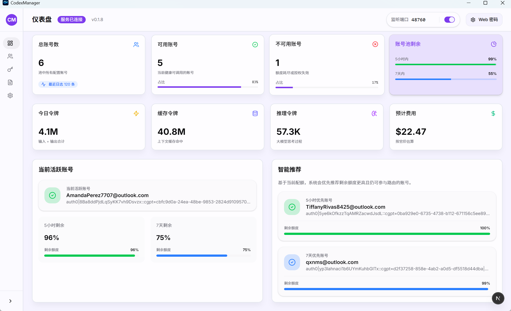
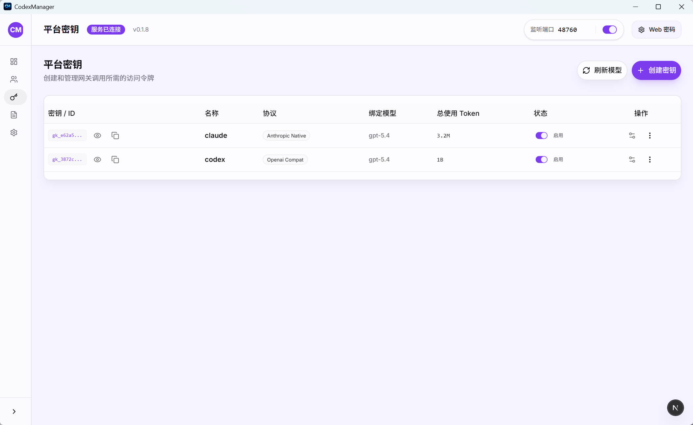
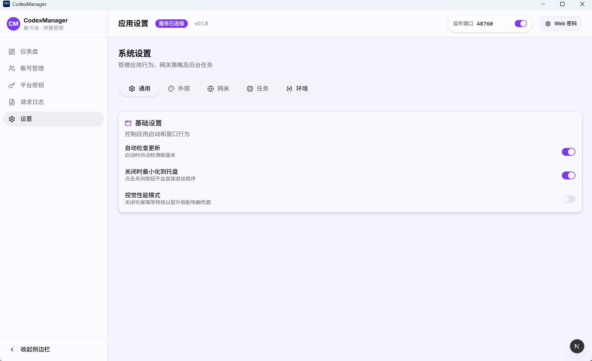

# CodexManager

账号池、模型网关与用量管理工具。当前为独立维护版本，已移除赞助广告、收款码和远程推广内容。

- 当前仓库：[16dongdong/CodexManager](https://github.com/16dongdong/CodexManager)
- 开源出处：基于 Codex-Manager，原版权与 MIT 许可见 [LICENSE](LICENSE)。
- 更新检查指向当前仓库；发布新版本前不会提供上游安装包。

## 首页导览
| 你要做什么 | 直接进入 |
| --- | --- |
| 首次启动、部署、Docker、macOS 放行 | [运行与部署指南](docs/zh-CN/report/运行与部署指南.md) |
| 配置 Codex CLI / ccswitch 接入、`auth.json` 与 `config.toml` | [运行与部署指南](docs/zh-CN/report/运行与部署指南.md#通过-ccswitch-接入) |
| 不登陆 Codex，使用 ChatGPT `/api/auth/session` 导入账号 | [不登陆 Codex 使用 ChatGPT 的 /api/auth/session 在软件中的使用](docs/zh-CN/report/不登陆Codex使用ChatGPT-auth-session导入账号.md) |
| 配置端口、代理、数据库、Web 密码、环境变量 | [环境变量与运行配置](docs/zh-CN/report/环境变量与运行配置说明.md) |
| 排查账号不命中、导入失败、挑战拦截、请求异常 | [FAQ 与账号命中规则](docs/zh-CN/report/FAQ与账号命中规则.md) |
| 排查后台任务账号跳过、禁用与停用原因 | [后台任务账号跳过说明](docs/zh-CN/report/后台任务账号跳过说明.md) |
| 管理模型、价格、路由、instructions policy 与本地缓存导出 | [模型目录 V2 管理与计费说明](docs/zh-CN/report/模型目录V2管理与计费说明.md) |
| 插件中心最小接入、快速对接 | [插件中心最小接入说明](docs/zh-CN/report/插件中心最小接入说明.md) |
| 对接插件中心、查看接口清单、市场模式与 Rhai 接口 | [插件中心对接与接口清单](docs/zh-CN/report/插件中心对接与接口清单.md) |
| 系统全部可对接内部接口 | [系统内部接口总表](docs/zh-CN/report/系统内部接口总表.md) |
| 本地构建、打包、发版、脚本调用 | [构建发布与脚本说明](docs/zh-CN/release/构建发布与脚本说明.md) |

## 功能概览
- 账号池管理：分组、标签、排序、备注、封禁识别与封禁筛选
- 批量导入 / 导出：支持多文件导入、桌面端文件夹递归导入 JSON、按账号导出单文件
- 用量展示：支持标准 5 小时 + 7 日窗口、仅 7 日单窗口账号，以及 Code Review / Spark 等官方附加额度窗口；刷新后会统一展示各额度的剩余百分比与重置时间
- 授权登录：支持 `chatgpt.com` 浏览器授权与 Device Code 登录；浏览器授权仍可手动粘贴回调地址完成解析
- 平台 Key：随机生成或自定义固定 Key、禁用、删除、模型绑定、推理等级、服务等级（跟随请求 / Standard / Fast / Ultrafast / Flex）；可绑定自定义账号分组，并与账号计划筛选取交集后仅在授权池内轮转
- 模型管理：模型目录 V2 是唯一运行时真相源；支持 builtin/custom、整数三价与长上下文阶梯价、账号池/聚合 API route、instructions policy、本地 JSON preview/commit，以及桌面/Web 主动导出 Codex 缓存
- 聚合 API：管理第三方最小转发上游，支持创建、编辑、余额和基于已配置 V2 route 的连通性测试；不会自动发现供应商模型，管理员可主动拉取并选择性关联到模型目录 V2，不维护旧供应商模型池
- 插件中心：路由为 `/plugins/`，支持内置精选、企业私有、自定义源三种市场模式，并提供插件清单、任务、日志与 Rhai 对接接口
- Skills 与插件：`/skills/` 按“Skills 安装 / Codex 插件安装”分栏。Skills 安装提供内置及自定义 GitHub 技能仓库、仓库刷新与单 Skill 安装、skills.sh 搜索安装、ZIP / 目录导入和已安装管理；Codex 插件安装保留原生 Marketplace 的完整插件安装流程，`.system` 内置 Skill 始终只读
- 项目启动（桌面端）：收藏本机项目目录；Windows / macOS 通过 ChatGPT Codex App 打开对应工作区，“会话”继续使用本机 CodexManager profile 在新终端中打开 `resume` 选择器
- 设置页：支持“系统推导”按钮、单账号并发上限、上游代理、请求总超时、流式空闲超时、SSE 保活开关与间隔，以及更保守的高并发退化策略；SSE 保活默认开启，可通过 `CODEXMANAGER_SSE_KEEPALIVE_ENABLED=0`（或 `false`）关闭；实验性上游 WebSocket 可通过 `CODEXMANAGER_USE_WEBSOCKET_UPSTREAM=1` 开启，默认关闭
- 系统内部接口总表：列出当前桌面端与服务端所有可对接命令、RPC 方法、以及插件内建函数
- 本地服务：自动拉起、可自定义端口与监听地址
- 本地网关：为 Codex CLI、Gemini CLI、Claude Code 和第三方工具提供统一 OpenAI 兼容入口；Gemini 请求可转发到 `/v1/responses`，并兼容 SSE、tools、MCP、skill、请求总超时与流式空闲超时等调用链路
- 图片生成：默认按官方 Codex 行为为 `/v1/responses` 自动注入 `image_generation` tool，并支持显式 tool 透传、`/v1/images/generations` 与 `/v1/images/edits` 兼容入口，默认图片工具模型为 `gpt-image-2`

## 截图







## 快速开始
1. 启动桌面端，点击“启动服务”。
2. 进入“账号管理”，选择浏览器授权或 Device Code 完成 `chatgpt.com` 登录。
3. 浏览器授权如回调失败，可粘贴回调链接手动完成解析。
4. 刷新用量并确认账号状态。

## 默认数据目录
- 桌面端默认会把 SQLite 数据库写到应用数据目录下，文件名固定为 `codexmanager.db`。
- Windows：`%APPDATA%\\com.codexmanager.desktop\\codexmanager.db`
- macOS：`~/Library/Application Support/com.codexmanager.desktop/codexmanager.db`
- Linux：`~/.local/share/com.codexmanager.desktop/codexmanager.db`
- 桌面端每次升级首次初始化数据库前，会在数据库同目录保留 `codexmanager.db.pre-<版本>.bak` 快照；同一版本失败重试时不会覆盖该备份。
- 设置页“桌面诊断”可启用 Debug 模式、关闭普通桌面文件日志并打开日志目录。普通运行日志限制为 512 KB 并自动覆盖；请求日志与 Token / 费用统计不受这个开关影响。
- 如果界面无法启动，可使用 `CodexManager.exe --debug`（macOS / Linux 为 `CodexManager --debug`）临时启用详细日志。启动失败会弹出具体原因，并将 `startup-error.log` 写入弹窗所示的日志目录。
- 如需调整数据库、代理、监听地址等运行配置，可继续查看 [环境变量与运行配置](docs/zh-CN/report/环境变量与运行配置说明.md)。
- Docker 镜像默认使用 `TZ=Asia/Shanghai`；compose 示例会优先沿用部署环境里的 `TZ`，没有设置时回退到 `Asia/Shanghai`，其他地区部署时请改成对应 IANA 时区。

## 页面展示
### 桌面端
- 账号管理：集中导入、导出、刷新账号与用量，支持低配额 / 封禁筛选与重置时间展示
- 平台 Key：按模型、推理等级、服务等级绑定平台 Key，并查看调用日志
- 模型管理：桌面端和 Web 端都不会写入或下载 `~/.codex/models_cache.json`；账号直连跟随 Codex 官方目录，本地网关使用 CodexManager 管理目录下独立生成的 catalog
- 插件中心：`/plugins/` 路由，内置精选 / 企业私有 / 自定义源市场切换，插件安装、启停、任务、日志、Rhai 对接
- Skills 与插件：`/skills/` 路由以独立 Tab 管理 Skills 安装和 Codex 插件安装；Skills 可从内置/自定义 GitHub 仓库或 skills.sh 搜索后单独安装，也支持 ZIP、目录导入和安全卸载；Codex 原生 Marketplace 继续负责完整插件安装，系统 Skill 只读
- 项目启动：桌面端收藏本机目录；Windows / macOS 直接在 ChatGPT Codex App 中打开对应工作区，“会话”通过本机 CLI 继续项目；Web / Docker 不访问设备目录
- 设置页：统一管理端口、监听地址、代理、请求超时、SSE 保活、主题、自动更新、后台行为

### Service 版
- `codexmanager-service`：提供本地 OpenAI 兼容网关
- `codexmanager-web`：提供浏览器管理页面，并承载 `/api/runtime` 与 `/api/rpc` 代理
- `codexmanager-start`：一键拉起 service + web

## 常用文档
- 版本历史：[CHANGELOG.md](docs/zh-CN/CHANGELOG.md)
- 协作约定：[CONTRIBUTING.md](docs/zh-CN/CONTRIBUTING.md)
- 架构说明：[ARCHITECTURE.md](docs/zh-CN/ARCHITECTURE.md)
- 测试基线：[TESTING.md](docs/zh-CN/TESTING.md)
- 安全说明：[SECURITY.md](docs/zh-CN/SECURITY.md)
- 模型目录 V2：[模型目录 V2 管理与计费说明](docs/zh-CN/report/模型目录V2管理与计费说明.md)
- 文档索引：[docs/zh-CN/README.md](docs/zh-CN/README.md)

## 专题页面
| 页面 | 内容 |
| --- | --- |
| [运行与部署指南](docs/zh-CN/report/运行与部署指南.md) | 首次启动、Docker、Service 版、macOS 放行 |
| [环境变量与运行配置](docs/zh-CN/report/环境变量与运行配置说明.md) | 应用配置、代理、监听地址、数据库、Web 安全 |
| [FAQ 与账号命中规则](docs/zh-CN/report/FAQ与账号命中规则.md) | 账号命中、挑战拦截、导入导出、常见异常 |
| [不登陆 Codex 使用 ChatGPT 的 /api/auth/session 在软件中的使用](docs/zh-CN/report/不登陆Codex使用ChatGPT-auth-session导入账号.md) | 浏览器复制 ChatGPT session JSON 后，通过批量导入加入账号池 |
| [后台任务账号跳过说明](docs/zh-CN/report/后台任务账号跳过说明.md) | 后台任务过滤、禁用账号、workspace 停用原因 |
| [最小排障手册](docs/zh-CN/report/最小排障手册.md) | 快速定位服务启动、请求转发、模型刷新异常 |
| [插件中心对接与接口清单](docs/zh-CN/report/插件中心对接与接口清单.md) | 插件中心路由、市场模式、Tauri/RPC 接口、清单字段、Rhai 内建函数 |
| [构建发布与脚本说明](docs/zh-CN/release/构建发布与脚本说明.md) | 本地构建、Tauri 打包、Release workflow、脚本参数 |
| [发布与产物说明](docs/zh-CN/release/发布与产物说明.md) | 各平台发版产物、命名、是否 pre-release |
| [脚本与发布职责对照](docs/zh-CN/report/脚本与发布职责对照.md) | 各脚本负责什么、什么场景该用哪个 |
| [当前网关与 Codex 请求头和参数差异表](docs/zh-CN/report/当前网关与Codex请求头和参数差异表.md) | 当前网关参数传递、请求头和请求参数与 Codex 的对照说明 |
| [系统内部接口总表](docs/zh-CN/report/系统内部接口总表.md) | 桌面端、服务端、插件中心全部可对接内部接口 |
| [CHANGELOG.md](docs/zh-CN/CHANGELOG.md) | 最新发版内容、未发版更新与完整版本历史 |

## 目录结构
```text
.
├─ apps/                # 前端与 Tauri 桌面端
│  ├─ src/
│  ├─ src-tauri/
│  └─ out/
├─ crates/              # Rust core/service
│  ├─ core
│  ├─ service
│  ├─ start              # Service 版本一键启动器（拉起 service + web）
│  └─ web                # Service 版本 Web UI（可内嵌静态资源 + /api/rpc 代理）
├─ docs/                # 正式文档目录
├─ scripts/             # 构建与发布脚本
└─ README.md
```

## 鸣谢与参考项目

- Codex（OpenAI）：本项目在请求链路、登录语义与上游兼容行为上参考了该项目的实现与源码结构 <https://github.com/openai/codex>
- CLIProxyAPI（CPA）：本项目在请求链路（Responses 请求转换与工具调用约定）参考其实现与约定 <https://github.com/router-for-me/CLIProxyAPI>
