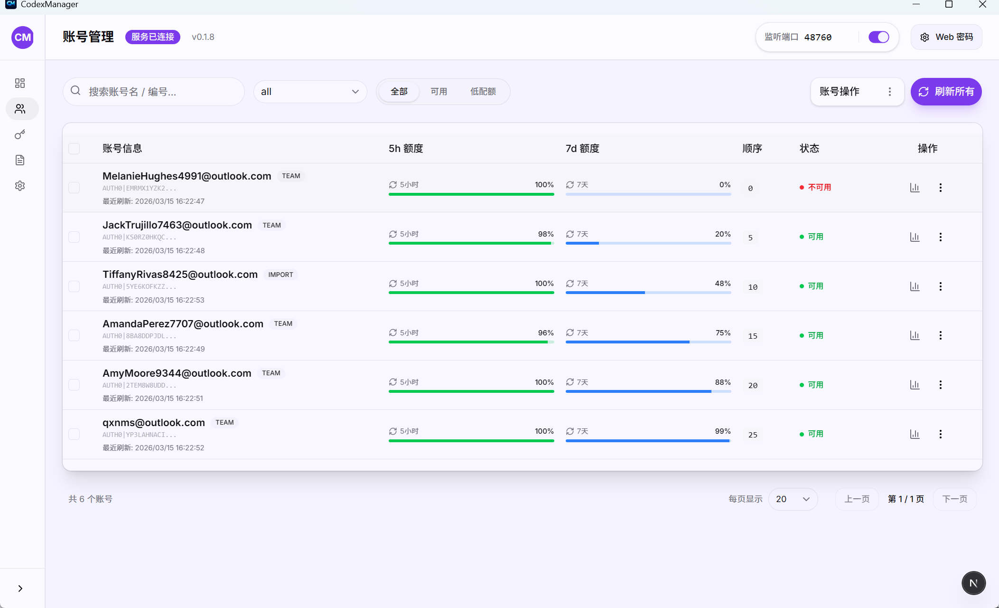
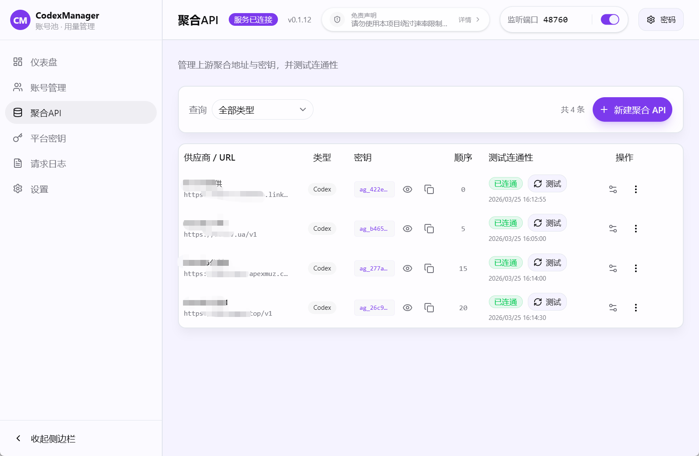
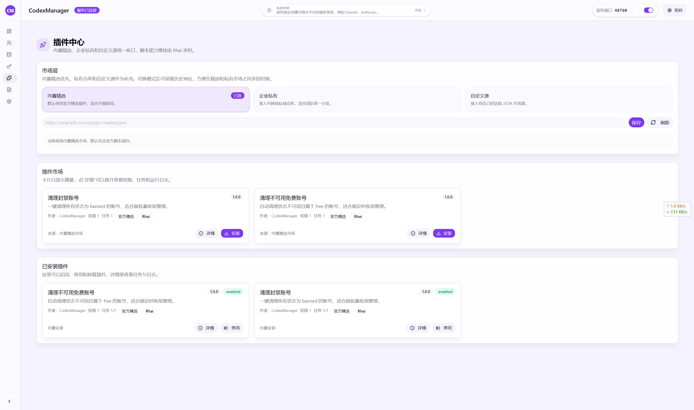
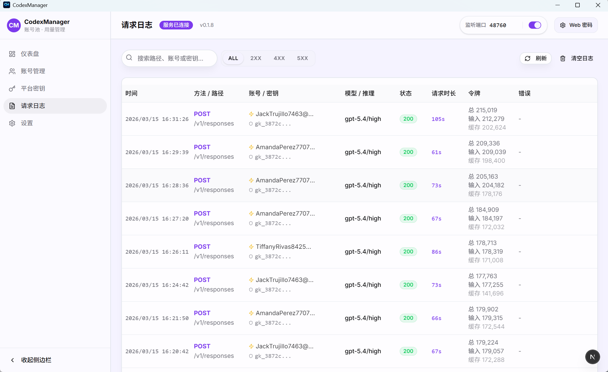

# CodexManager

## Навигация по главной странице

| Что нужно сделать | Открыть документ |
| --- | --- |
| Первый запуск, развёртывание, Docker, разрешение macOS | [Руководство по запуску и развёртыванию](report/Руководство-по-запуску-и-развертыванию.md) |
| Настройка Codex CLI / ccswitch, `auth.json` и `config.toml` | [Руководство по запуску и развёртыванию](report/Руководство-по-запуску-и-развертыванию.md#подключение-через-ccswitch) |
| Импорт аккаунта через ChatGPT `/api/auth/session` без входа через Codex | [Китайское руководство по импорту ChatGPT session](../zh-CN/report/不登陆Codex使用ChatGPT-auth-session导入账号.md) |
| Порты, proxy, база данных, Web-пароль и переменные среды | [Переменные среды и конфигурация запуска](report/Переменные-среды-и-конфигурация-запуска.md) |
| Маршрутизация аккаунтов, ошибки импорта, challenge и запросы | [FAQ и правила маршрутизации аккаунтов](report/FAQ-и-правила-маршрутизации-аккаунтов.md) |
| Почему фоновые задачи пропускают или отключают аккаунты | [Пропуск аккаунтов фоновыми задачами](report/Пропуск-аккаунтов-фоновыми-задачами.md) |
| Модели, цены, маршруты, instructions policy и экспорт cache | [Китайское руководство по Model Catalog V2](../zh-CN/report/模型目录V2管理与计费说明.md) |
| Минимальная интеграция центра плагинов | [Минимальная интеграция центра плагинов](report/Минимальная-интеграция-центра-плагинов.md) |
| Интерфейсы, режимы marketplace и Rhai API | [Интеграция центра плагинов и интерфейсы](report/Интеграция-центра-плагинов-и-интерфейсы.md) |
| Все внутренние интерфейсы системы | [Сводка внутренних интерфейсов](report/Сводка-внутренних-интерфейсов-системы.md) |
| Сборка, упаковка, выпуск и скрипты | [Сборка, выпуск и скрипты](release/Сборка-выпуск-и-скрипты.md) |

## Обзор возможностей

- Управление пулом аккаунтов: группы, теги, порядок, заметки, обнаружение блокировок и фильтрация.
- Пакетный импорт и экспорт: несколько файлов, рекурсивный импорт JSON-папки на desktop и отдельный файл для каждого аккаунта.
- Использование: стандартные окна 5 часов + 7 дней, аккаунты только с 7-дневным окном и дополнительные лимиты Code Review / Spark с процентами остатка и временем сброса.
- Авторизация: browser OAuth на `chatgpt.com` и Device Code; callback URL можно вставить вручную.
- Platform Key: генерация или фиксированное значение, отключение, удаление, привязка модели, уровня рассуждений и service tier; ограничение собственной группой и plan-фильтром.
- Модели: Model Catalog V2 — единственный runtime-источник; builtin/custom, трёхуровневая и long-context цена, маршруты account pool / aggregate API, instructions policy, JSON preview/commit и экспорт Codex cache.
- Aggregate API: создание, изменение, баланс и проверка подключения сторонних upstream по V2 routes; модели поставщика загружаются и связываются администратором выборочно.
- Центр плагинов: `/plugins/`, встроенный, корпоративный и пользовательский marketplace, манифесты, задачи, логи и Rhai.
- Skills и плагины: `/skills/` разделяет установку Skills и Codex Plugin; поддерживает GitHub, skills.sh, ZIP/каталоги и управление установками, а `.system` Skills остаются только для чтения.
- Запуск проектов: desktop сохраняет локальные каталоги; Windows/macOS открывают workspace в ChatGPT Codex App, а «Сессии» запускают `resume` в новом терминале с локальным профилем.
- Настройки: системные значения, лимит параллелизма, upstream proxy, общий и stream idle timeout, SSE keepalive и безопасная деградация. Keepalive отключается через `CODEXMANAGER_SSE_KEEPALIVE_ENABLED=0`, экспериментальный WebSocket включается через `CODEXMANAGER_USE_WEBSOCKET_UPSTREAM=1`.
- Реестр внутренних интерфейсов: desktop/service-команды, RPC и встроенные функции плагинов.
- Локальный сервис: автоматический запуск, настраиваемые порт и адрес.
- Локальный шлюз: единый OpenAI-совместимый endpoint для Codex CLI, Gemini CLI, Claude Code и сторонних инструментов; Gemini → `/v1/responses`, SSE, tools, MCP, skills и timeout.
- Генерация изображений: автоматическая вставка `image_generation` для `/v1/responses`, endpoints `/v1/images/generations` и `/v1/images/edits`, модель по умолчанию `gpt-image-2`.

## Скриншоты









## Быстрый старт

1. Запустите desktop-приложение и нажмите **Запустить сервис**.
2. В разделе **Аккаунты** выберите browser authorization или Device Code для входа на `chatgpt.com`.
3. Если callback не сработал, вставьте его URL вручную.
4. Обновите данные об использовании и проверьте состояние аккаунта.

## Каталог данных по умолчанию

- SQLite-база desktop-приложения хранится в каталоге данных приложения под именем `codexmanager.db`.
- Windows: `%APPDATA%\\com.codexmanager.desktop\\codexmanager.db`
- macOS: `~/Library/Application Support/com.codexmanager.desktop/codexmanager.db`
- Linux: `~/.local/share/com.codexmanager.desktop/codexmanager.db`
- Перед первой инициализацией после обновления рядом сохраняется `codexmanager.db.pre-<версия>.bak`; повторная попытка той же версии не перезаписывает его.
- «Диагностика desktop» включает Debug, отключает обычный файловый лог и открывает каталог логов. Обычный лог ограничен 512 КБ; журнал запросов и статистика токенов/стоимости не затрагиваются.
- Если UI не запускается, используйте `CodexManager.exe --debug` (на macOS/Linux — `CodexManager --debug`). Причина показывается в окне и записывается в `startup-error.log`.
- Настройки базы, proxy и адреса описаны в [конфигурации запуска](report/Переменные-среды-и-конфигурация-запуска.md).
- Docker использует `TZ=Asia/Shanghai`; Compose наследует `TZ` окружения или применяет этот fallback. Для другого региона задайте подходящий IANA timezone.

## Интерфейс

### Desktop

- Аккаунты: импорт, экспорт, обновление аккаунтов и лимитов, фильтры низкой квоты/блокировки и время сброса.
- Platform Key: привязка по модели, reasoning tier и service tier, просмотр журнала запросов.
- Модели: desktop и Web не записывают и не загружают `~/.codex/models_cache.json`; direct accounts используют официальный каталог, локальный gateway — отдельный управляемый каталог.
- Плагины: `/plugins/`, режимы marketplace, установка, включение, задачи, логи и Rhai.
- Skills и плагины: `/skills/`, отдельные вкладки, GitHub/skills.sh, импорт ZIP/каталога, безопасное удаление, Marketplace и read-only системные Skills.
- Проекты: локальные каталоги открываются в ChatGPT Codex App на Windows/macOS; «Сессии» используют локальный CLI; Web/Docker не получают доступ к каталогам устройства.
- Настройки: порт, адрес, proxy, timeout, SSE keepalive, тема, обновления и фоновое поведение.

### Service-версия

- `codexmanager-service`: локальный OpenAI-совместимый шлюз.
- `codexmanager-web`: Web-интерфейс и proxy `/api/runtime`, `/api/rpc`.
- `codexmanager-start`: совместный запуск service + web.

## Основные документы

- История версий: [Журнал изменений](Журнал-изменений.md)
- Участие: [Руководство для участников](Руководство-для-участников.md)
- Архитектура: [Архитектура](Архитектура.md)
- Тестирование: [Тестирование](Тестирование.md)
- Безопасность: [Безопасность](Безопасность.md)
- Model Catalog V2: [китайское руководство](../zh-CN/report/模型目录V2管理与计费说明.md)
- Индекс документации: [китайский индекс документации](../zh-CN/README.md)

## Тематические страницы

| Страница | Содержание |
| --- | --- |
| [Запуск и развёртывание](report/Руководство-по-запуску-и-развертыванию.md) | Первый запуск, Docker, Service и macOS |
| [Переменные среды и конфигурация](report/Переменные-среды-и-конфигурация-запуска.md) | Настройки, proxy, адрес, база и Web-безопасность |
| [FAQ и маршрутизация аккаунтов](report/FAQ-и-правила-маршрутизации-аккаунтов.md) | Выбор аккаунта, challenge, импорт/экспорт и ошибки |
| [Китайское руководство по ChatGPT session](../zh-CN/report/不登陆Codex使用ChatGPT-auth-session导入账号.md) | Копирование session JSON и пакетный импорт |
| [Пропуск аккаунтов](report/Пропуск-аккаунтов-фоновыми-задачами.md) | Фильтры фоновых задач и причины отключения |
| [Минимальное устранение неполадок](report/Минимальное-руководство-по-устранению-неполадок.md) | Запуск сервиса, relay и обновление моделей |
| [Интеграция центра плагинов](report/Интеграция-центра-плагинов-и-интерфейсы.md) | Routes, marketplace, Tauri/RPC, manifest и Rhai |
| [Сборка, выпуск и скрипты](release/Сборка-выпуск-и-скрипты.md) | Локальная сборка, Tauri, workflow и параметры |
| [Выпуск и артефакты](release/Выпуск-и-артефакты.md) | Артефакты, имена и pre-release |
| [Матрица скриптов и релиза](report/Матрица-ответственности-скриптов-и-релиза.md) | Ответственность скриптов и сценарии |
| [Различия gateway и Codex](report/Различия-заголовков-и-параметров-шлюза-с-Codex.md) | Заголовки и параметры запросов |
| [Внутренние интерфейсы](report/Сводка-внутренних-интерфейсов-системы.md) | Desktop, service и plugin center |
| [Журнал изменений](Журнал-изменений.md) | Релизы, изменения до выпуска и история |

## Структура каталогов

```text
.
├─ frontend/                # Frontend и Tauri desktop
│  ├─ src/
│  ├─ src-tauri/
│  └─ out/
├─ backend/crates/              # Rust core/service
│  ├─ core
│  ├─ service
│  ├─ start              # Запуск service + web
│  └─ web                # Service Web UI и /api/rpc proxy
├─ docs/                # Официальная документация
├─ backend/scripts/             # Скрипты сборки и выпуска
└─ README.md
```

## Благодарности и проекты-источники

- Codex (OpenAI): проект использует его подходы к цепочке запросов, авторизации и совместимости с upstream <https://github.com/openai/codex>
- CLIProxyAPI (CPA): проект использует его соглашения преобразования Responses-запросов и tool calls <https://github.com/router-for-me/CLIProxyAPI>
